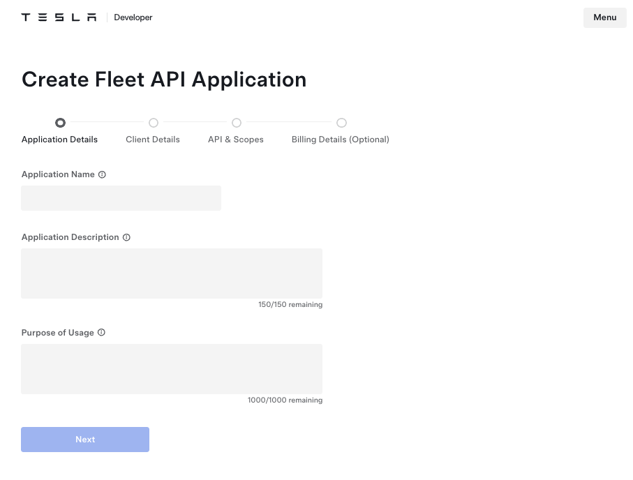
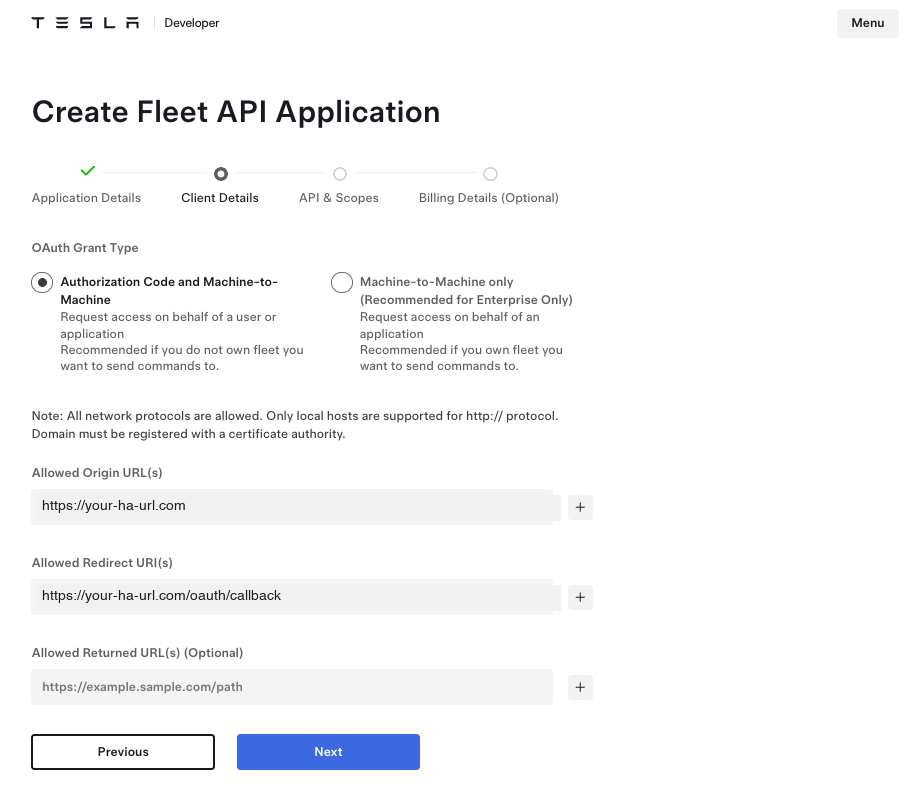
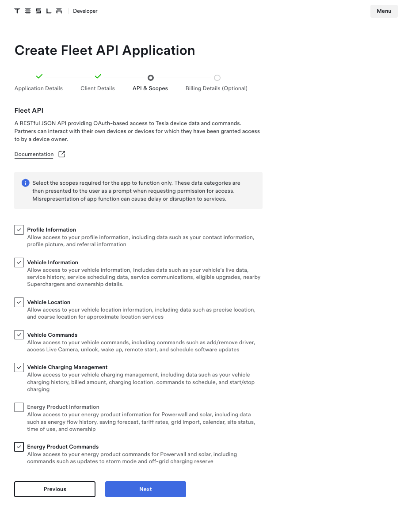
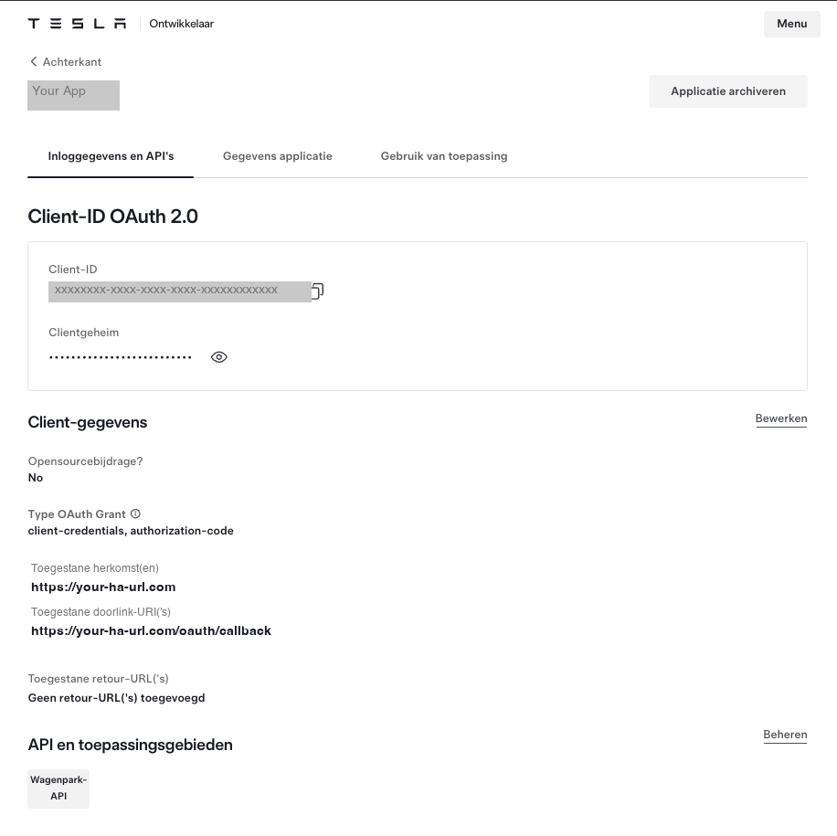

# Tesla Fleet Setup for Home Assistant

[](https://github.com/hacs/integration)
[](https://github.com/ds2000/ha-tesla-fleet-setup/releases)
[](LICENSE)

A Home Assistant add-on that turns the complex Tesla Fleet API setup into a
guided 10-minute wizard.

If you find this useful: [](https://www.buymeacoffee.com/daveshaw301)

## The Problem

Connecting Tesla vehicles to Home Assistant via the official Fleet API requires:

1. Registering as a developer on Tesla's portal
2. Generating an EC P-256 cryptographic key pair
3. Hosting the public key on an HTTPS domain at `/.well-known/appkeys`
4. Setting up nginx or another reverse proxy with SSL
5. Completing Tesla's partner authentication flow
6. Running through the OAuth authorization flow

For most users, steps 2-4 are major stumbling blocks that require Linux CLI
knowledge, domain configuration, and SSL certificate management.

## The Solution

This add-on automates everything except the Tesla developer portal registration
(which Tesla requires to be done manually). It provides:

- **Automatic key generation** -- no command line needed
- **Automatic URL detection** -- uses Nabu Casa, your configured external URL, or
  creates a free temporary Cloudflare tunnel
- **Guided registration walkthrough** -- step-by-step instructions with copy-paste
  fields for the Tesla developer portal
- **One-click partner verification** -- calls Tesla's API and handles the
  public key verification automatically
- **OAuth flow** -- sign in with Tesla and authorize access

## Installation

### HACS (recommended)

[](https://my.home-assistant.io/redirect/hacs_repository/?owner=ds2000&repository=ha-tesla-fleet-setup&category=integration)

Or manually:
1. Open HACS in Home Assistant
2. Click the three dots (menu) and select **Custom repositories**
3. Add `https://github.com/ds2000/ha-tesla-fleet-setup` as category **Add-on**
4. Find **Tesla Fleet Setup** and click **Install**

### Manual

1. In Home Assistant, go to **Settings -> Add-ons -> Add-on Store**
2. Click the three dots -> **Repositories**
3. Add: `https://github.com/ds2000/ha-tesla-fleet-setup`
4. Find **Tesla Fleet Setup** in the store and click **Install**
5. Click **Start**, then open the **Web UI**

## The Wizard

The add-on walks you through five steps. Everything except step 3 is fully
automated.

### Step 1: Generate Keys

Keys are generated automatically with one click. No terminal needed.

### Step 2: Expose Public Key

The add-on detects the best way to make your public key reachable:
- **Nabu Casa** -- detected automatically, zero effort
- **External URL** -- uses your configured HA external URL
- **Cloudflare Tunnel** -- creates a free temporary tunnel (no account needed)

A built-in self-test confirms Tesla can reach your key before you proceed.

### Step 3: Register on Tesla Developer Portal

This is the one manual step (~2-3 minutes). The wizard provides copy-paste
fields for every value you need:

<p align="center">
  
  
</p>
<p align="center">
  
  
</p>

### Step 4: Partner Verification

One click -- the add-on calls Tesla's API and Tesla verifies your public key.

### Step 5: Connect

Sign in with your Tesla account. After approval, setup is complete and you
can add the **Tesla Fleet** integration in Home Assistant.

## URL Detection Priority

The add-on tries these methods in order:

1. **Nabu Casa** -- if you have a Home Assistant Cloud subscription, your
   `*.ui.nabu.casa` URL is used automatically
2. **External URL** -- if you've configured an external URL in HA settings
3. **Cloudflare Tunnel** -- a free temporary tunnel is created (no account
   needed). It only exposes the `/.well-known/appkeys` endpoint and shuts
   down after setup

## Security

- **Credentials stored locally only** -- your Client ID, Client Secret, and OAuth
  tokens are stored in the add-on's private `/data` directory with restricted
  file permissions (mode 0600). They never leave your device.
- **No credential logging** -- all log output is sanitized. Tokens, secrets,
  and authorization codes are never written to log files.
- **Minimal tunnel exposure** -- the Cloudflare tunnel only serves the public key
  endpoint. All other paths return 404. The tunnel is shut down after setup.
- **OAuth state validation** -- the OAuth flow uses a cryptographically random
  state parameter to prevent CSRF attacks. It is cleared after use.
- **Access log suppression** -- HTTP access logs are disabled to prevent OAuth
  callback URLs (which contain authorization codes) from appearing in logs.

## Local Development

```bash
# Normal mode (real API calls)
python3 run_local.py

# Demo mode (all external calls mocked, click through full flow)
python3 run_local.py --demo
```

Then open http://localhost:8099/

## Architecture

```
config.yaml              -- HA add-on metadata
Dockerfile               -- Alpine + Python + cloudflared
build.yaml               -- Base images per architecture
run.sh                   -- Entrypoint
rootfs/opt/tesla-setup/
  server.py              -- aiohttp server: wizard UI + API + .well-known
  keygen.py              -- EC P-256 key generation
  tunnel.py              -- Cloudflare quick tunnel management
  tesla_api.py           -- Tesla Fleet API (partner auth + OAuth)
  ha_discovery.py        -- Detect Nabu Casa / external URL
  templates/
    wizard.html          -- Single-page wizard UI
```

## Requirements

- Home Assistant OS or Supervised installation (add-ons require the Supervisor)
- Internet access (for Tesla API calls and optional Cloudflare tunnel)
- A Tesla account with at least one vehicle

## Related Projects

- [homeassistant-fe-tesla](https://github.com/ds2000/homeassistant-fe-tesla) --
  Tesla card for Home Assistant dashboards
- [homeassistant-fe-tesla-image-uploader](https://github.com/ds2000/homeassistant-fe-tesla-image-uploader) --
  Community image contribution pipeline

## License

MIT
