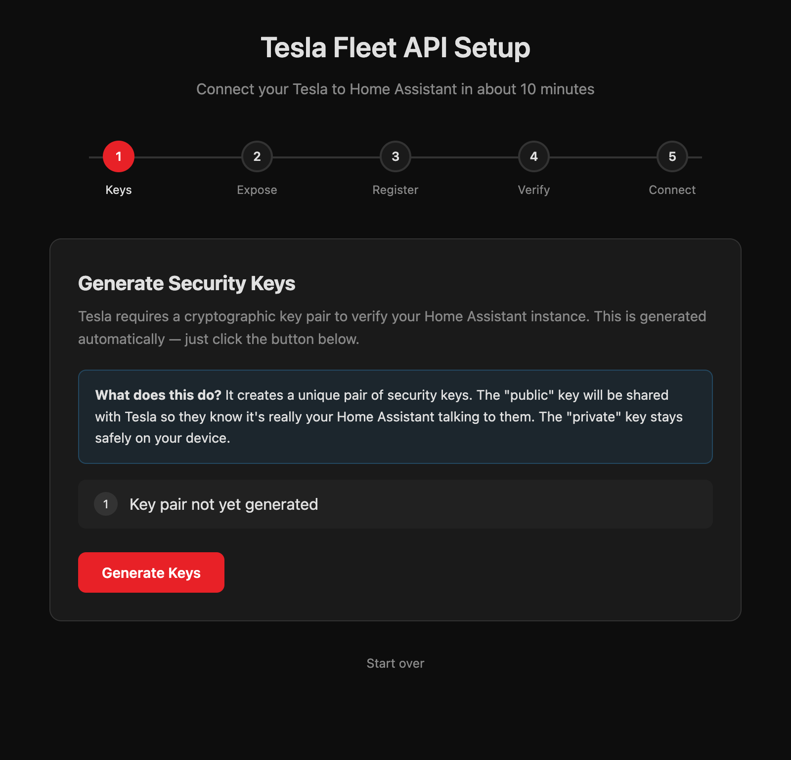
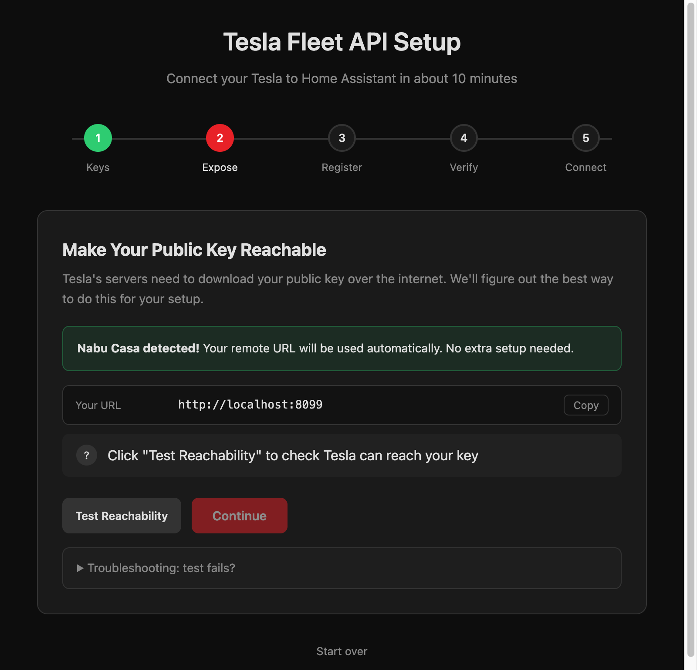
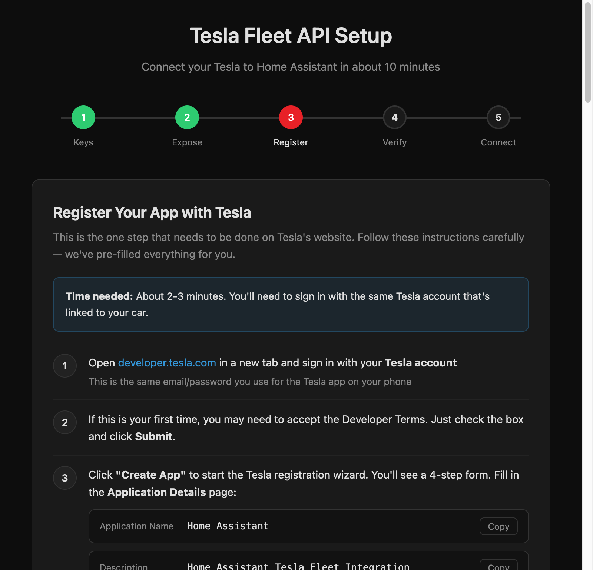
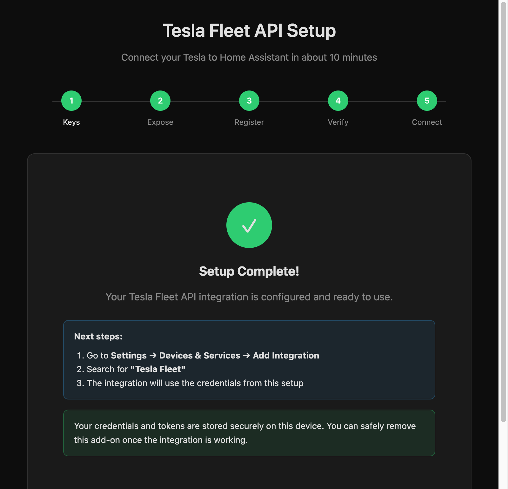

# Tesla Fleet Setup for Home Assistant

[](https://github.com/hacs/integration)
[](https://github.com/ds2000/ha-tesla-fleet-setup/releases)
[](LICENSE)

A Home Assistant add-on that turns the complex Tesla Fleet API setup into a
guided 10-minute wizard.

If you find this useful: [](https://www.buymeacoffee.com/daveshaw301)

## The Problem

Connecting Tesla vehicles to Home Assistant via the official Fleet API requires:

1. Registering as a developer on Tesla's portal
2. Generating an EC P-256 cryptographic key pair
3. Hosting the public key on an HTTPS domain at `/.well-known/appkeys`
4. Setting up nginx or another reverse proxy with SSL
5. Completing Tesla's partner authentication flow
6. Running through the OAuth authorization flow

For most users, steps 2-4 are major stumbling blocks that require Linux CLI
knowledge, domain configuration, and SSL certificate management.

## The Solution

This add-on automates everything except the Tesla developer portal registration
(which Tesla requires to be done manually). It provides a step-by-step wizard
that handles all the technical complexity for you.

<p align="center">
  
  
</p>
<p align="center">
  
  
</p>

## Installation

### HACS (recommended)

[](https://my.home-assistant.io/redirect/hacs_repository/?owner=ds2000&repository=ha-tesla-fleet-setup&category=integration)

Or manually:
1. Open HACS in Home Assistant
2. Click the three dots (menu) and select **Custom repositories**
3. Add `https://github.com/ds2000/ha-tesla-fleet-setup` as category **Add-on**
4. Find **Tesla Fleet Setup** and click **Install**

### Manual

1. In Home Assistant, go to **Settings -> Add-ons -> Add-on Store**
2. Click the three dots -> **Repositories**
3. Add: `https://github.com/ds2000/ha-tesla-fleet-setup`
4. Find **Tesla Fleet Setup** in the store and click **Install**
5. Click **Start**, then open the **Web UI**

## How It Works

The wizard walks you through five steps:

| Step | What happens | Your effort |
|------|-------------|-------------|
| 1. Keys | EC P-256 key pair is generated automatically | Click one button |
| 2. Expose | Public key URL is detected or tunnel is created | Zero (auto) or one click |
| 3. Register | Guided walkthrough for developer.tesla.com | ~2 min of copy-paste |
| 4. Verify | Partner authentication with Tesla | Click one button |
| 5. Connect | OAuth sign-in with your Tesla account | Sign in and approve |

After setup is complete, you can add the **Tesla Fleet** integration in
Home Assistant and remove this add-on.

### URL Detection Priority

The add-on tries these methods in order:

1. **Nabu Casa** -- if you have a Home Assistant Cloud subscription, your
   `*.ui.nabu.casa` URL is used automatically
2. **External URL** -- if you've configured an external URL in HA settings
3. **Cloudflare Tunnel** -- a free temporary tunnel is created (no account
   needed). It only exposes the `/.well-known/appkeys` endpoint and shuts
   down after setup

## Security

- **Credentials stored locally only** -- your Client ID, Client Secret, and OAuth
  tokens are stored in the add-on's private `/data` directory with restricted
  file permissions (mode 0600). They never leave your device.
- **No credential logging** -- all log output is sanitized. Tokens, secrets,
  and authorization codes are never written to log files.
- **Minimal tunnel exposure** -- the Cloudflare tunnel only serves the public key
  endpoint. All other paths return 404. The tunnel is shut down after setup.
- **OAuth state validation** -- the OAuth flow uses a cryptographically random
  state parameter to prevent CSRF attacks. It is cleared after use.
- **Access log suppression** -- HTTP access logs are disabled to prevent OAuth
  callback URLs (which contain authorization codes) from appearing in logs.

## Local Development

```bash
# Normal mode (real API calls)
python3 run_local.py

# Demo mode (all external calls mocked, click through full flow)
python3 run_local.py --demo
```

Then open http://localhost:8099/

## Requirements

- Home Assistant OS or Supervised installation (add-ons require the Supervisor)
- Internet access (for Tesla API calls and optional Cloudflare tunnel)
- A Tesla account with at least one vehicle

## Related Projects

- [homeassistant-fe-tesla](https://github.com/ds2000/homeassistant-fe-tesla) --
  Tesla card for Home Assistant dashboards
- [homeassistant-fe-tesla-image-uploader](https://github.com/ds2000/homeassistant-fe-tesla-image-uploader) --
  Community image contribution pipeline

## License

MIT
