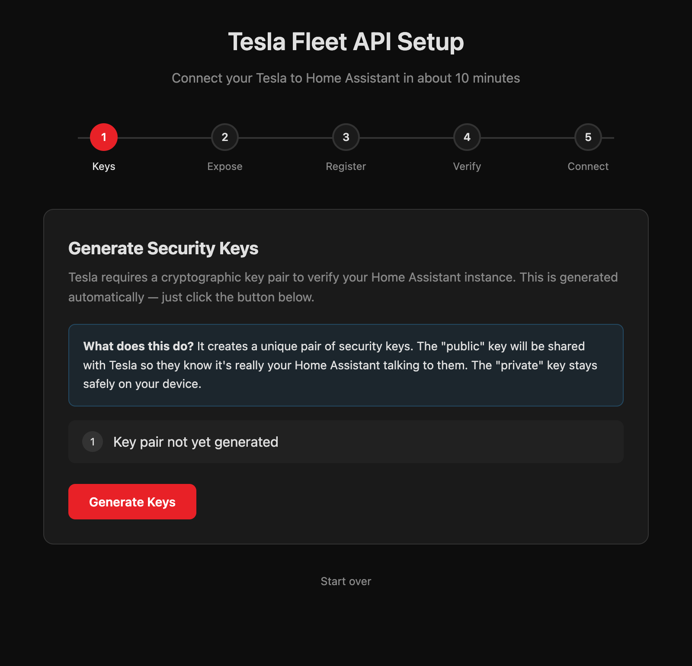
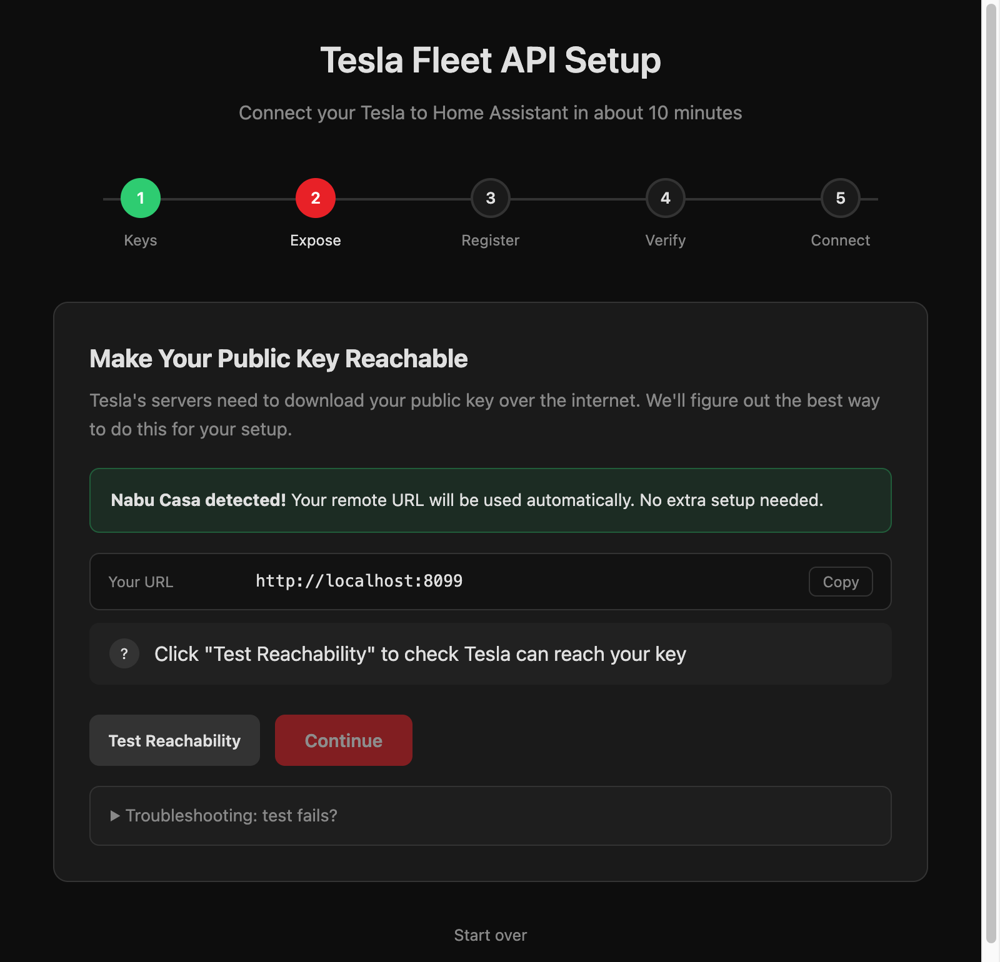
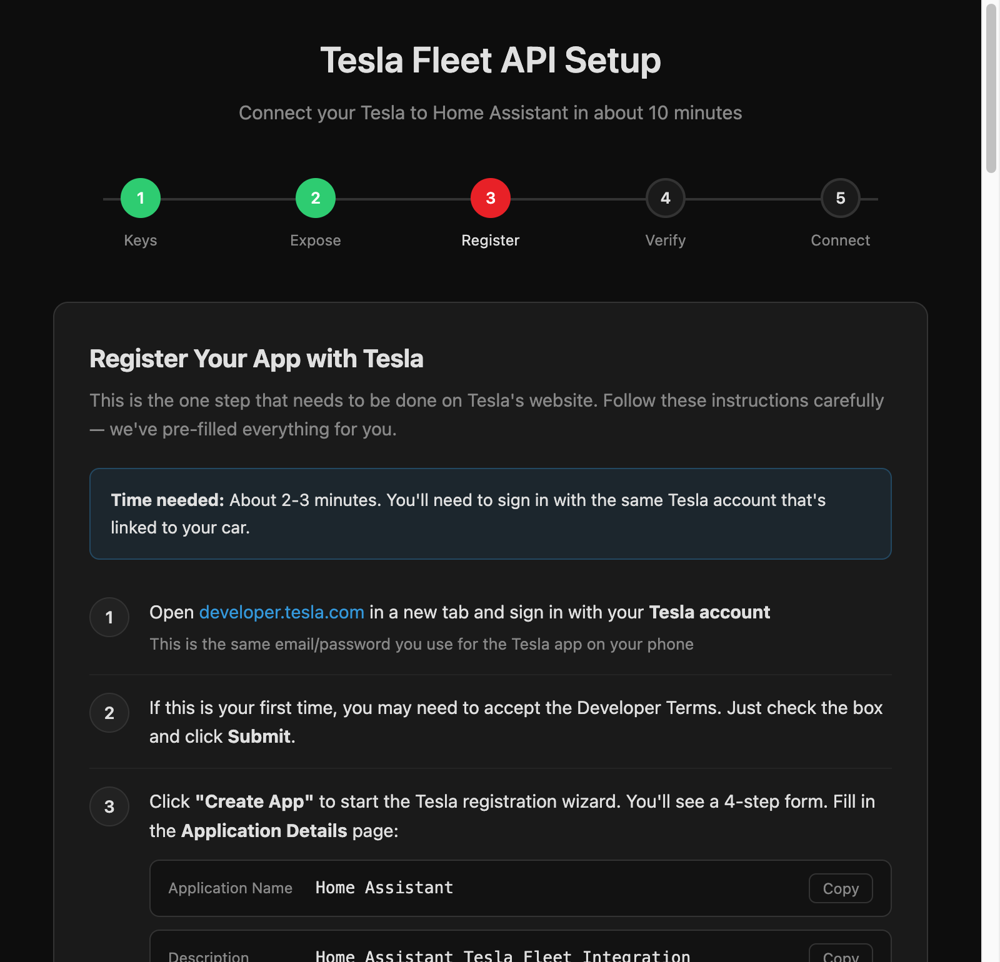
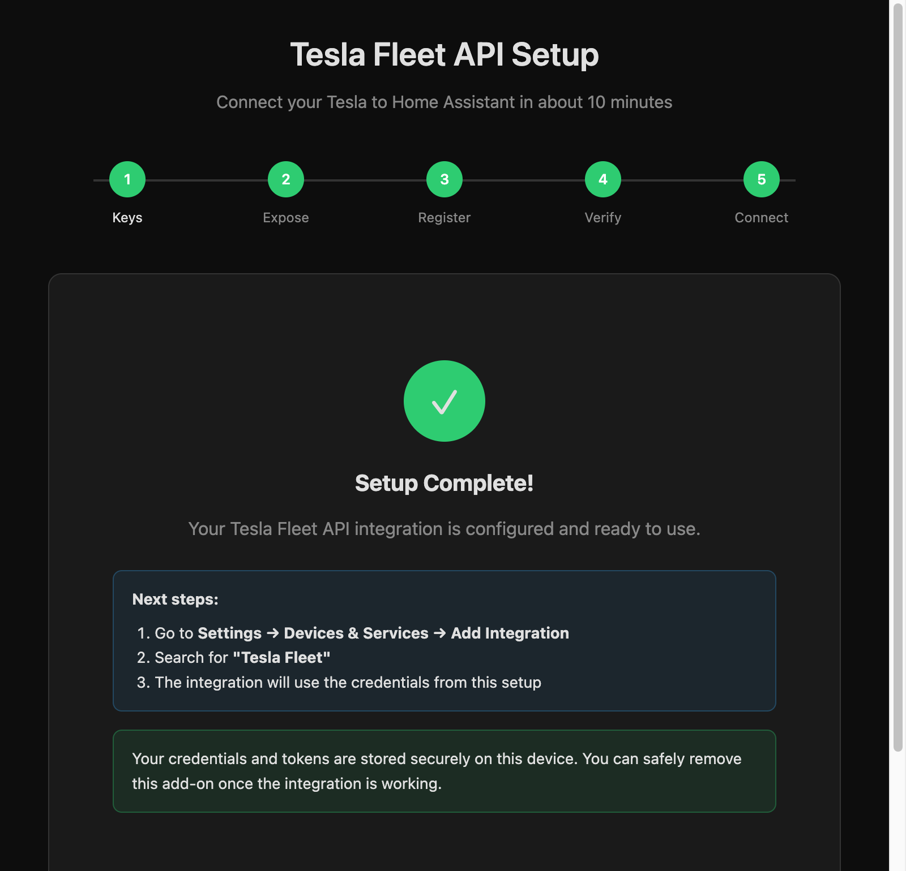

# Tesla Fleet Setup for Home Assistant

[](https://github.com/ds2000/ha-tesla-fleet-setup/releases)
[](LICENSE)
[]()

A Home Assistant add-on that turns the complex Tesla Fleet API setup into a
guided 10-minute wizard — and then keeps running as a **signing proxy** so
your integrations can send secure vehicle commands.

If you find this useful: [](https://www.buymeacoffee.com/daveshaw301)

## The Problem

Connecting Tesla vehicles to Home Assistant via the official Fleet API requires:

1. Registering as a developer on Tesla's portal
2. Generating an EC P-256 cryptographic key pair
3. Hosting the public key on an HTTPS domain at `/.well-known/appkeys`
4. Setting up nginx or another reverse proxy with SSL
5. Completing Tesla's partner authentication flow
6. Running through the OAuth authorization flow
7. Setting up `tesla-http-proxy` for signed vehicle commands
8. Manually entering credentials into HA's Application Credentials

For most users, steps 2-4 and 7-8 are major stumbling blocks that require Linux
CLI knowledge, Go compilation, domain configuration, and SSL certificate management.

## The Solution

This add-on automates **everything** except the Tesla developer portal registration
(which Tesla requires to be done manually). It provides a step-by-step wizard
that handles all the technical complexity, then runs a signing proxy so your
integrations can send secure vehicle commands.

<p align="center">
  
  
</p>
<p align="center">
  
  
</p>

## Features

- **5-step guided wizard** -- key generation, public key hosting, Tesla app registration, partner verification, and OAuth connection
- **Built-in signing proxy** -- `tesla-http-proxy` compiled from Tesla's official source, runs on port 4443 for signed vehicle commands (security level 10+)
- **Auto-inject HA credentials** -- your Client ID and Client Secret are automatically saved to HA's Application Credentials store via WebSocket API, so the Tesla Fleet integration picks them up with zero re-entry
- **Works with multiple integrations** -- the signing proxy is compatible with the built-in Tesla Fleet integration, tesla_custom_component (alandtse/tesla), and any integration that supports the Fleet API proxy protocol
- **API testing dashboard** -- after setup, test vehicle data, commands, and connectivity directly from the add-on UI
- **Cloudflare tunnel** -- free temporary tunnel for public key hosting during setup (no account needed, shuts down after)

## Installation

[](https://my.home-assistant.io/redirect/supervisor_add_addon_repository/?repository_url=https%3A%2F%2Fgithub.com%2Fds2000%2Fha-tesla-fleet-setup)

Or manually:

1. In Home Assistant, go to **Settings -> Add-ons -> Add-on Store**
2. Click the three dots top-right -> **Repositories**
3. Add: `https://github.com/ds2000/ha-tesla-fleet-setup`
4. Click **Add**, then refresh the page
5. Find **Tesla Fleet Setup** in the store and click **Install**
6. Click **Start**, then open the **Web UI**

## How It Works

The wizard walks you through five steps:

| Step | What happens | Your effort |
|------|-------------|-------------|
| 1. Keys | EC P-256 key pair is generated automatically | Click one button |
| 2. Expose | Cloudflare tunnel created to host your public key | One click |
| 3. Register | Guided walkthrough for developer.tesla.com | ~2 min of copy-paste |
| 4. Verify | Partner authentication with Tesla | Click one button |
| 5. Connect | OAuth sign-in with your Tesla account | Sign in and approve |

After setup completes:
- **Signing proxy starts automatically** on port 4443
- **Credentials are injected** into HA's Application Credentials
- Just go to **Settings -> Add Integration -> Tesla Fleet** and follow the prompts

**Keep this add-on running** -- it provides the signing proxy that enables
secure vehicle commands (lock, unlock, climate, etc.).

## Signing Proxy

After setup, `tesla-http-proxy` runs on port 4443, signing vehicle commands
with your private key. This is what enables security level 10+ commands.

### Using with integrations

**HA Tesla Fleet (built-in):**
1. Go to Settings -> Devices & Services -> Add Integration -> Tesla Fleet
2. Credentials are already saved -- just follow the prompts
3. Tap your NFC key card on the vehicle's center console when prompted

**Tesla Custom Integration (alandtse/tesla):**
1. Install via HACS
2. During setup, check "Use Fleet API proxy"
3. Enter the proxy URL: `https://tesla-fleet-setup:4443`

**Other integrations / scripts:**
Any integration supporting the Tesla Fleet API proxy protocol can use
`https://tesla-fleet-setup:4443`. Use `--insecure` / disable TLS verification
(self-signed certificate).

## Security

- **Credentials stored locally only** -- Client ID, Client Secret, and OAuth
  tokens are stored in `/data` with restricted file permissions (mode 0600)
- **No credential logging** -- all log output is sanitized. Tokens, secrets,
  and authorization codes are never written to log files
- **Minimal tunnel exposure** -- the Cloudflare tunnel only serves the public
  key endpoint and OAuth callback. All other paths return 404
- **OAuth state validation** -- cryptographically random state parameter,
  cleared after use to prevent replay
- **Separate TLS and signing keys** -- the proxy's TLS certificate uses a
  different key pair from the Tesla command-signing key
- **102 automated tests** -- including security tests for credential exposure,
  tunnel isolation, OAuth replay, file permissions, and input validation

## Local Development

```bash
# Install dev dependencies
pip install -r requirements-dev.txt

# Run tests (102 tests)
python3 -m pytest tests/ -v

# Lint (ruff with bandit security rules)
python3 -m ruff check tesla-fleet-setup/rootfs/opt/tesla-setup/ tests/

# Security audit
pip install pip-audit && python3 -m pip_audit -r tesla-fleet-setup/requirements.txt

# Normal mode (real API calls)
python3 run_local.py

# Demo mode (all external calls mocked)
python3 run_local.py --demo
```

Then open http://localhost:8099/

## Architecture

```
Docker Container
+--------------------------------------------------+
|  Python aiohttp server (port 8099)               |
|  - Wizard UI via HA Ingress                      |
|  - /.well-known/appkeys endpoint                 |
|  - API routes for wizard + vehicle testing        |
|  - Cloudflare tunnel management                  |
|                                                  |
|  tesla-http-proxy (port 4443)                    |
|  - Signs vehicle commands with EC P-256 key      |
|  - Self-signed TLS for inter-container comms     |
|  - Auto-starts after setup / on boot             |
+--------------------------------------------------+
```

## Requirements

- Home Assistant OS or Supervised installation (add-ons require the Supervisor)
- Internet access (for Tesla API calls and Cloudflare tunnel)
- A Tesla account with at least one vehicle

## Supported Architectures

- amd64 (Intel/AMD 64-bit)
- aarch64 (ARM 64-bit, e.g., Raspberry Pi 4/5)
- armv7 (ARM 32-bit, e.g., Raspberry Pi 3)

## Related Projects

- [homeassistant-fe-tesla](https://github.com/ds2000/homeassistant-fe-tesla) --
  Tesla card for Home Assistant dashboards
- [homeassistant-fe-tesla-image-uploader](https://github.com/ds2000/homeassistant-fe-tesla-image-uploader) --
  Community image contribution pipeline

## License

MIT
